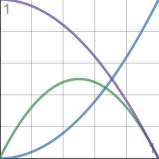

# Spline

## 样条

* Non uniform rational B-spline\(NURBS\) \(非均匀有理B样条\)
  * B spline （B样条）
    * Bezier spline \(贝塞尔样条\)
* Hermite spline \(厄尔密样条\)
  * Cubic Hermite spline \(三次厄尔密样条\)
    * Cardinal spline \(基数样条\)
    * Catmull-Rom spline
      * Centripetal Catmull–Rom spline
      * Uniform Catmull-Rom spline
      * Chordal Catmull-Rom spline

## 非均匀有理B样条

首先观察一个二次贝塞尔曲线

$$
B(t) = (1 - t)^2P_0 + 2(1-t)tP_1 + t^2P_2\\
0 \leq t \leq 1
$$

会发现它无非就是定义了

* 3个控制点
* 一个区间 $$[0, 1]$$ 
* 3个以 $$t$$ 为自变量的权重函数（称为basic function，即基函数，B样条的B指的就是basis）

将这3个权重函数绘制到图表

 

对于任意的二次贝塞尔曲线，控制点的个数，权重函数和区间是固定的，但事实上可以用更为灵活的方式定义曲线，在这之前需要引入一个概念——Knot Vector（节点向量）。

节点向量指的是，基函数与 $$x$$ 轴交点的 $$x$$ 值以从小到大的顺序排列所组成的向量，以上述的二次贝塞尔曲线为例，其节点向量为 $$(0, 0, 1, 1)$$ 。

接下来定义NURBS， $$n$$ 为控制点的个数， $$x_i$$ 表示第 $$i$$ 个节点。 $$k$$ 称为基函数的order（序），对于一个序为 $$k$$ 的样条，也可以说它是一条 $$(k-1)$$ degree（次、阶）样条。 $$\omega_i$$ 是控制点的权重因子，如果都为 $$1$$ ，则这是一条B样条

$$
Q(t)=\frac{{\displaystyle\sum_{i=0}^{n-1}}B_i\omega_iN_{i,k}(t)}{{\displaystyle\sum_{i=0}^{n-1}}\omega_iN_{i,k}(t)}\\
N_{i,k}(t)=\frac{t-x_i}{x_{i+k-1}-x_i}N_{i,k-1}(t)+\frac{x_{i+k}-t}{x_{i+k}-x_{i+1}}N_{i+1,k-i}(t)\\
N_{i,\;1}(t)\;=\;\left\{\begin{array}{l}1\;\;\;if\;x_i\leq t<x_{i+1}\\0\;\;\;otherwise\end{array}\right.\\
$$

注意这个数学定义是经过精心设计的，它具有以下性质

* 对于任意 $$t$$ ，基函数的和为 $$1$$ 
* 对于任意 $$t$$ ，不超过 $$k$$ 个基函数同时对曲线有影响
* 节点的数量始终等于控制点的数量加上样条的序

## 贝塞尔曲面

$$
P(u,v)=\sum_{i=1}^n\;\sum_{j=1}^mB_i^n(u)B_j^m(v)P_{ij}\\
B_i^n(u)=\left(\begin{array}{c}n\\i\end{array}\right) u^i(1-u)^{n-i}\\
\left(\begin{array}{c}n\\i\end{array}\right) = {n! \over {i!(n-i)!}}
$$

$$n+1$$ 是沿着 $$u$$ 方向上的控制点个数， $$m+1$$ 是沿着 $$v$$ 方向的控制点个数，共有 $$(n + 1)•(m + 1)$$ 个控制点。写成矩阵形式的话

$$
P(u,v)= U N B M V\\
U\;=\;\begin{bmatrix}u^n&u^{n-1}&...&1\end{bmatrix}\\
V\;=\;\begin{bmatrix}v^m&v^{m-1}&...&1\end{bmatrix}^T\\
B=\begin{bmatrix}B_{0,0}&...&B_{0,m}\\...&...&...\\B_{n,0}&...&B_{n,m}\end{bmatrix}
$$

其中 $$N$$ 和 $$M$$ 是常数组成的矩阵

